# Layout

<!-- TOC depthFrom:2 -->

- [Box](#box)
- [Stack](#stack)
- [Inline](#inline)
  - [numeric space](#numeric-space)
  - [between](#between)
  - [around](#around)
  - [evenly](#evenly)
- [ResponsiveLayout](#responsivelayout)
- [HeaderLayout](#headerlayout)
- [GridLayout](#gridlayout)
- [Basic](#basic)
  - [Grid template 6+6](#grid-template-66)
  - [Grid template 8+4](#grid-template-84)
- [NegativeBox](#negativebox)
- [Without NegativeBox](#without-negativebox)
- [With NegativeBox](#with-negativebox)

<!-- /TOC -->

## Box

Box provides a set of padding options which can be used to create container elements with **internal**
spacing.

Accepted props:

- `padding`
- `paddingX` / `paddingY`
- `paddingTop` / `paddingRight` / `paddingBottom` / `paddingLeft`

```tsx
<Box paddingX={16} paddingY={32}>
  <Child />
</Box>
```

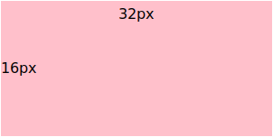

:warning: Do not use `Box` to add external spacings or distribute items, instead use `Stack` or `Inline`.

## Stack

Vertically distributes its children using the given `space` separation

```tsx
<Stack space={24}>
  <Child1 />
  <Child2 />
  <Child3 />
</Stack>
```

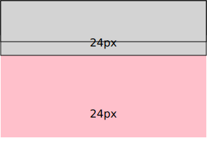

## Inline

Horizontally distributes its children using the given `space` separation. This component can be considered as
an horizontal `Stack`

### numeric space

```tsx
<Inline space={16}>
  <Child1 />
  <Child2 />
  <Child3 />
</Inline>
```

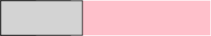

### between

Distribute items evenly. The first item is flush with the start, the last is flush with the end

```tsx
<Inline fullWidth space="between">
  <Child1 />
  <Child2 />
  <Child3 />
</Inline>
```


### around

Distribute items evenly. Items have a half-size space on either end

```tsx
<Inline fullWidth space="around">
  <Child1 />
  <Child2 />
  <Child3 />
</Inline>
```

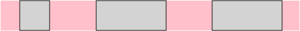

### evenly

Distribute items evenly. Items have equal space around them

```tsx
<Inline fullWidth space="evenly">
  <Child1 />
  <Child2 />
  <Child3 />
</Inline>
```

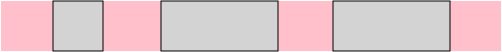

## ResponsiveLayout

This component creates a responsive container for your page content. The size of this container depends on the
viewport size.

```tsx
<ResponsiveLayout>
  <MyFeature />
</ResponsiveLayout>
```

<!-- prettier-ignore -->
|Mobile|Tablet|Desktop|
|-|-|-|
||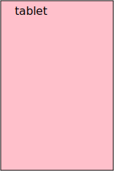|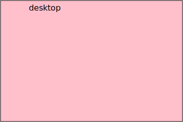|

## HeaderLayout

The `HeaderLayout` is responsible to render the page header and related components. It uses the
`ResponsiveLayout` internally so you must not wrap it inside one.

```tsx
<HeaderLayout header={<Header title="Header" />} />
<ResponsiveLayout>
  <MyFeature />
</ResponsiveLayout>
```

<!-- prettier-ignore -->
|Mobile|Tablet|Desktop|
|-|-|-|
|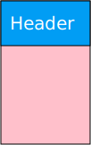|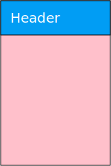|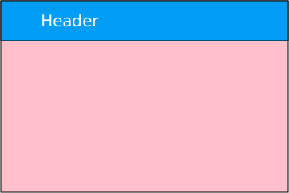|

## GridLayout

The `GridLayout` uses defines a grid with a set of columns where you can place your components. Different
screen sizes will have different number of columns. This component must be used inside a `ResponsiveLayout`

## Basic

This layout is quite low level and not very useful by its own. When implementing a feature, use one of the
available grid templates

```tsx
<ResponsiveLayout>
  <GridLayout>
    <Component1 />
    <Component2 />
    {/* ... */}
    <ComponentN />
  </GridLayout>
</ResponsiveLayout>
```

<!-- prettier-ignore -->
|Mobile|Tablet|Desktop|
|-|-|-|
|1 column|1 column|12 columns|
||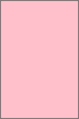|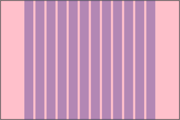|

### Grid template 6+6

```tsx
<ResponsiveLayout>
  <GridLayout
    template="6+6"
    left={<LeftComponent />}>
    right={<RightComponent />}>
  />
</ResponsiveLayout>
```

<!-- prettier-ignore -->
|Mobile|Tablet|Desktop|
|-|-|-|
|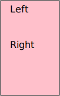|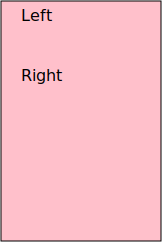|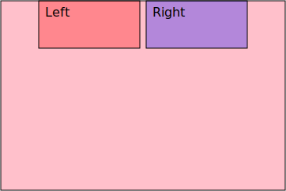|

### Grid template 8+4

```tsx
<ResponsiveLayout>
  <GridLayout
    template="8+4"
    left={<LeftComponent />}>
    right={<RightComponent />}>
  />
</ResponsiveLayout>
```

<!-- prettier-ignore -->
|Mobile|Tablet|Desktop|
|-|-|-|
|||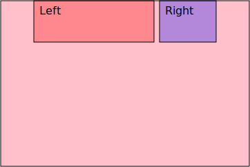|

## NegativeBox

Some components, like non boxed Lists, need to be rendered overflowing its container, because the hover effect
is larger than the container. This can be achieved using a `NegativeBox`

## Without NegativeBox

<!-- prettier-ignore -->
|Outline|Preview|
|-|-|
|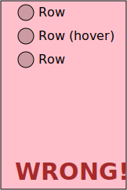|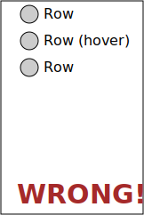|

As you can see there are two problems. The hover is not filling available horizontal space and Row circles are
not aligned with the content container. These problems are solved using `NegativeBox`.

## With NegativeBox

```tsx
<ResponsiveLayout>
  <NegativeBox>
    <List>
      <Row1 />
      <Row2 />
      <Row3 />
    </List>
  </NegativeBox>
</ResponsiveLayout>
```

<!-- prettier-ignore -->
|Outline|Preview|
|-|-|
|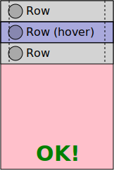|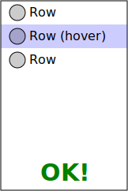|

Hover effect fills horizontal space and circles are aligned with the container edge.

<!--
https://app.zeplin.io/project/5d653c69f828bf7299c551c1/screen/5f86c28d86f1d96c0f9c601d

https://mistica-web.vercel.app/playroom#?code=N4Igxg9gJgpiBcIA8AlGBnADhAduglgG4wAyAhgJ4QCuALgHwA6OABC0gEIQAeLmZUKPhwBzAJoBeYACYALAF8mrNuwDKtMmADWLLJphSAjADZFzFSqSqYYWvlwAVfLQA2MeqogBbGLpt3cJAB6a1t7HCdXd3MLdgcYblppFgAnGBFqFzIUpViVdG9fWgTaFgALGDTdQpZixPLKjBq60oqqgp9akob25pKYvLbfDqLuoerOlp7hvvrxka65xomYAdipobW2YPjE6VzYpAA5dLI7Yi5uA7zUCAB3Enx0Bi3DlHvXvPxIHClPvPYAGF8CkwG4WAAjTRaEQpGg4KCAiAuCApKSQFEpdAAOhwMDoKTILhI93kunwAC8DMBZAAGMzKAEApAASR%2BAEEwAIYF5vo8RGVSkFrkzLEFgaC3CKmfJ-hZvrhVJTqXTZYzRXYohJGCBIm4dXKVLB0GAUvhMAFfjqACIYU3my0G9VM3AABTS6HQUgAFABKFgSegsYDyNWiljCw23O6GtgK37AWOWCVg3xQ7Sw%2BGI5Go9E5rG4-G0QnE0nkqlSVXS8PsNm4Tnc3lgfmCiPVpnBFNSpNhmvxpUVmn0pOatza3XOfUgJPG%2B0W8Lj20ms3z3BOmssN0er3AP0BoMh3tMyPOt4fU9fH5-C-Mrtp6GZ6gIpGYvOYnF4glEkl3MkEQdVkmFishyXKwE2LZCu2zLiiCqbQRYR6iv2yqVsON4WKOBg6nqqzThhRp2iulqLkRDrhOuNZbhgO57oGwahoaJ4dkE7wPE8LynsEJwiGcRAwJcIrBOo0IHMEgnMMEaBYLgBDEOQVB0EoIAADQgLQFQ%2BOgCAANogAAakQEAgAAumpdz4FAGnafAOkAMzSLSJnyEAA

https://mistica-web.vercel.app/playroom#?code=N4Igxg9gJgpiBcJgHoBUACATAFgA4A90AjGAFwHcYYA7dACxgENYAndR6qdXRgcxnSRqpGqXSpkAXwA61ADwBlUozABrdAGceYGAF5gOSQD5Z6dHIASTVgBlGATwgBXUqbP1rMFvrfvzV5i90UgBLUgAbPWkQABUGdHDGDTEQ6gA3CBCddBCNdjTGEMSiSOjNJyJQiKiQBQqq0pB0ZBNadxk2lrc5ACUYLQhqDRC0mDtHF1a-FAwFbQESCipaDRgwUMG8iAAzdABmTAJxKV9zJRV1LRU9YAPjU7NFZTVNef0ARgA2e7a-R4U1htqDEwpEjAD1iFBuh3nJkBCgSDqlM-mYZug5tcMYCocDQQIOFwhCJhKJ0DsYZ8jhIOqjHgAFRI6OgQcKsZoovxw85qTnuJ4XV7XD7fPlchG4pFgiXQzDcnGDKUwMX8xnXFlsoJdX5-dGY7KLSg0dAwSIAW1EW12pHiGkYFs0CtoFK%2B1JOOq5auZrPZ2tR3OeqhVApeVx0%2BgAHD86WcnUrwU70OQwnQErlSPLIYr8Sq0WgMfNiGQjbQZXjqugehByDZ0%2BgABTUCDECD4GBQACU5N2EbdtLpcgAcjBeIxQqMAEKt3P8qs19Mzrlzh4xnJCHwe1ePADCIRYYEixAuvBYzk429ZEG8wEg4SvGgAdNQYC4WIxwjZq5JNCEAF43bAAAZoy3AcAEkhAAQTAQIzSyWteDoMQ-VArlkF3fcwRXGN%2B1QrJBgUP8AOA7C6QaGolWiUjUVgDQwBYEJcCBXRogAEX6ejGKBKjNxjQZ6RYfoNH0esu10Ix0GASRcNXFCt16atqL%2BfDqA3VCuQwg8FmPU8nHPS9r1ve8nxfUg3w-L8f3-fQgJA9T%2BQgwZoNg%2BCQkQ5DFwHdC9y0zy-BkrcVMI6zgFspS-HIljYnxHj7NozimNxKL2LohjEsGWL1P4wSNGE4BRPQcTJOk8KOVKhTyFKswVLU%2BzzE0w8iB0s8oAvO9DIMx9n1fd9P3Ib9hhC2y-PAqCYNgOCwAQpCyt41c4Qa5UqvQALVyCoibJIubUUi6JKJAZb4rS5i2I447cUy1DsqEkSxIkqTVtROSvLnWtkhnOFh1HccYCnfBg3hQM%2BQDC4UThPoBiGEYxgcZxSFaEHeVkEAABoQBtGALQ0BAAG0QAAWQgNJ00YFgQAAXTR5MoBtbH4Bxg5AJR95AJwcnJCAA
-->
