# Layout

<!-- TOC depthFrom:2 -->

- [Core layout primitives](#core-layout-primitives)
  - [Box](#box)
  - [Stack](#stack)
  - [Inline](#inline)
    - [numeric space](#numeric-space)
    - [between](#between)
    - [around](#around)
    - [evenly](#evenly)
  - [Align](#align)
  - [Grid / GridItem](#grid--griditem)
  - [NegativeBox](#negativebox)
    - [Without NegativeBox](#without-negativebox)
    - [With NegativeBox](#with-negativebox)
  - [Divider](#divider)
  - [HorizontalScroll](#horizontalscroll)
  - [Boxed](#boxed)
  - [Overlay](#overlay)
  - [StackingGroup](#stackinggroup)
- [Page layouts](#page-layouts)
  - [ResponsiveLayout](#responsivelayout)
  - [HeaderLayout](#headerlayout)
  - [GridLayout](#gridlayout)
  - [MasterDetailLayout](#masterdetaillayout)
  - [FixedFooterLayout](#fixedfooterlayout)
  - [ButtonFixedFooterLayout](#buttonfixedfooterlayout)
  - [ButtonLayout](#buttonlayout)
  - [DoubleField](#doublefield)
- [Vertical rhythm](#vertical-rhythm)
- [Doubts?](#doubts)

<!-- /TOC -->

---

# Core layout primitives

These are the fundamental building blocks for spacing, alignment, and visual structure. Use them to compose
any UI inside a page.

## Box

Box provides a set of padding options which can be used to create container elements with **internal**
spacing. All padding props accept a numeric value or a responsive object `{mobile, tablet?, desktop}`.

```tsx
<Box paddingX={16} paddingY={32}>
  <Child />
</Box>
```

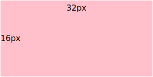

:warning: Do not use `Box` to add external spacings or distribute items, instead use `Stack` or `Inline`.

## Stack

Vertically distributes its children using the given `space` separation.

```tsx
<Stack space={24}>
  <Child1 />
  <Child2 />
  <Child3 />
</Stack>
```

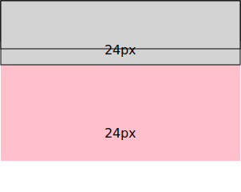

## Inline

Horizontally distributes its children using the given `space` separation. This component can be considered as
an horizontal `Stack`.

:information_source: Items can be aligned vertically. Check `Inline` component in
[Storybook](https://mistica-web.vercel.app/?path=/story/layout-inline--default) to learn more about it.

### numeric space

```tsx
<Inline space={16}>
  <Child1 />
  <Child2 />
  <Child3 />
</Inline>
```

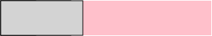

### between

Distribute items evenly. The first item is flush with the start, the last is flush with the end

```tsx
<Inline space="between">
  <Child1 />
  <Child2 />
  <Child3 />
</Inline>
```

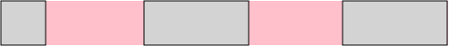

### around

Distribute items evenly. Items have a half-size space on either end

```tsx
<Inline space="around">
  <Child1 />
  <Child2 />
  <Child3 />
</Inline>
```

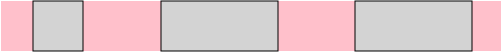

### evenly

Distribute items evenly. Items have equal space around them

```tsx
<Inline space="evenly">
  <Child1 />
  <Child2 />
  <Child3 />
</Inline>
```

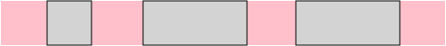

## Align

Positions its children within a container using CSS grid alignment. Useful for centering content or placing it
at specific positions within a defined area.

```tsx
<Align x="center" y="center" height="100%">
  <Text2 regular>Centered content</Text2>
</Align>
```

```tsx
<Align x="end">
  <ButtonPrimary onPress={() => {}}>Action</ButtonPrimary>
</Align>
```

## Grid / GridItem

A low-level CSS Grid component for creating custom grid layouts. For page-level column layouts, prefer
`GridLayout` instead. `Grid` is ideal for card grids, image galleries, or any layout needing explicit
row/column control.

```tsx
<Grid columns={3} gap={{mobile: 8, desktop: 16}}>
  <Card1 />
  <Card2 />
  <Card3 />
</Grid>
```

```tsx
<Grid columns={4} gap={16}>
  <GridItem columnSpan={2}>
    <FeatureCard />
  </GridItem>
  <GridItem>
    <SmallCard1 />
  </GridItem>
  <GridItem>
    <SmallCard2 />
  </GridItem>
</Grid>
```

## NegativeBox

Some components, like non boxed Lists, need to be rendered overflowing its container, because the hover effect
is larger than the container. This can be achieved using a `NegativeBox`.

By default both sides get negative margins. Use the `left` or `right` props to apply margin on one side only.

### Without NegativeBox

<!-- prettier-ignore -->
|Outline|Preview|
|-|-|
|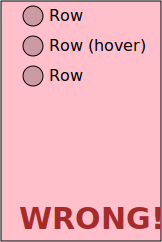|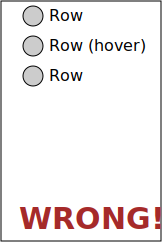|

As you can see there are two problems. The hover is not filling available horizontal space and Row circles are
not aligned with the content container. These problems are solved using `NegativeBox`.

### With NegativeBox

```tsx
<ResponsiveLayout>
  <NegativeBox>
    <RowList>
      <Row1 />
      <Row2 />
      <Row3 />
    </RowList>
  </NegativeBox>
</ResponsiveLayout>
```

<!-- prettier-ignore -->
|Outline|Preview|
|-|-|
|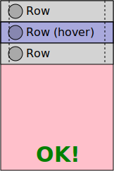|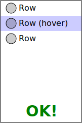|

Hover effect fills horizontal space and circles are aligned with the container edge.

## Divider

A simple horizontal divider line. Theme-variant-aware (adapts its color to the current `ThemeVariant`
context). Takes no props.

```tsx
<Stack space={16}>
  <Text2 regular>Section A</Text2>
  <Divider />
  <Text2 regular>Section B</Text2>
</Stack>
```

## HorizontalScroll

A container that enables horizontal scrolling for its children. Useful for scrollable rows of cards, chips,
tags, or any horizontally overflowing content.

```tsx
<HorizontalScroll>
  <Inline space={8}>
    <Chip value="Option 1">Option 1</Chip>
    <Chip value="Option 2">Option 2</Chip>
    <Chip value="Option 3">Option 3</Chip>
    <Chip value="Option 4">Option 4</Chip>
  </Inline>
</HorizontalScroll>
```

## Boxed

A rounded container with background color and optional border. Theme-variant-aware: the background and border
automatically adapt based on the current and specified `variant`. Useful for creating visually distinct
sections or card-like containers without card semantics.

```tsx
<Boxed>
  <Box padding={16}>
    <Text2 regular>Content inside a boxed container</Text2>
  </Box>
</Boxed>
```

## Overlay

A full-screen fixed overlay that covers the viewport. Used internally by dialogs, drawers, and sheets, but
available for custom overlay use cases.

```tsx
<Overlay onPress={handleClose} disableScroll>
  <MyCustomModal />
</Overlay>
```

## StackingGroup

Displays a group of items (typically avatars or icons) with optional overlapping. Shows a "+N" indicator when
items exceed `maxItems`.

```tsx
<StackingGroup stacked maxItems={3} moreItemsStyle={{type: 'circle', size: 40}}>
  <Avatar size={40} src={avatar1} />
  <Avatar size={40} src={avatar2} />
  <Avatar size={40} src={avatar3} />
  <Avatar size={40} src={avatar4} />
  <Avatar size={40} src={avatar5} />
</StackingGroup>
```

---

# Page layouts

These components define the overall structure of a page or screen. They handle responsive breakpoints,
constrain content width, and provide standard page patterns.

## ResponsiveLayout

Creates a responsive container for your page content. The size of this container depends on the viewport size.
Supports a `variant` prop to set background color and theme variant, and `fullWidth` to remove margin
constraints.

```tsx
<ResponsiveLayout>
  <MyFeature />
</ResponsiveLayout>
```

<!-- prettier-ignore -->
|Mobile|Tablet|Desktop|
|-|-|-|
|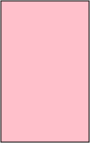|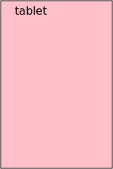|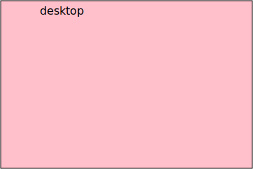|

## HeaderLayout

The `HeaderLayout` is responsible for render the page header and related components. It uses the
`ResponsiveLayout` internally so you must not wrap it inside one.

```tsx
<HeaderLayout header={<Header title="Header" />} />
<ResponsiveLayout>
  <MyFeature />
</ResponsiveLayout>
```

<!-- prettier-ignore -->
|Mobile|Tablet|Desktop|
|-|-|-|
|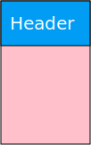|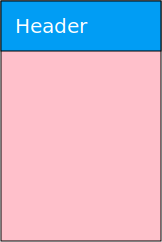|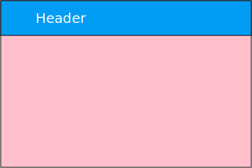|

## Components that include ResponsiveLayout internally

The following components manage their own `ResponsiveLayout` internally. **Do not wrap them inside a
`ResponsiveLayout`** — that would create a double-nested layout that breaks spacing and alignment.

| Component                 | Reason                                                                                                                                    |
| ------------------------- | ----------------------------------------------------------------------------------------------------------------------------------------- |
| `HeaderLayout`            | Wraps its header content in a responsive container                                                                                        |
| `MainSectionHeaderLayout` | Contains its own responsive wrapper                                                                                                       |
| `Hero`                    | Manages internal responsive layout for content and media                                                                                  |
| `CoverHero`               | Applies responsive layout to its text content column                                                                                      |
| `MasterDetailLayout`      | Full-width responsive grid managed internally                                                                                             |
| `ButtonFixedFooterLayout` | Footer buttons aligned via an internal responsive container                                                                               |
| `NavigationBar`           | All navigation bar variants (including `MainNavigationBar` and `FunnelNavigationBar`) center content using an internal `ResponsiveLayout` |
| `Tabs`                    | Tab list constrained with `ResponsiveLayout fullWidth`                                                                                    |
| `SuccessFeedbackScreen`   | All feedback screen variants contain their own page layout                                                                                |
| `LoadingScreen`           | `BrandLoadingScreen` also uses an internal responsive text layout                                                                         |

These components are placed **directly at the page level**, side by side with `ResponsiveLayout` blocks, not
inside them:

```tsx
<MainNavigationBar sections={[...]} selectedIndex={0} />
<HeaderLayout header={<Header title="Page Title" />} />
<Tabs selectedIndex={0} onChange={setTab} tabs={[{text: 'Tab 1'}, {text: 'Tab 2'}]} />
<ResponsiveLayout>
  <Box paddingY={24}>
    <Stack space={16}>
      <Text2 regular>Content</Text2>
    </Stack>
  </Box>
</ResponsiveLayout>
```

## GridLayout

A 12-column grid with predefined templates for common page layouts. Must be used inside a `ResponsiveLayout`.

Available templates:

- Split layouts (use `left`/`right` props): `'6+6'`, `'8+4'`, `'5+4'`, `'4+6'`, `'3+9'`
- Centered single-column layouts (use `children`): `'10'`, `'8'`
- No template (raw 12-column grid, use `children`)

<!-- prettier-ignore -->
```tsx
<ResponsiveLayout>
  <GridLayout
    template="6+6"
    left={<LeftComponent />}
    right={<RightComponent />}
  />
</ResponsiveLayout>
```

<!-- prettier-ignore -->
|Mobile|Tablet|Desktop|
|-|-|-|
|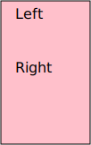|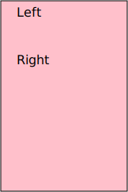|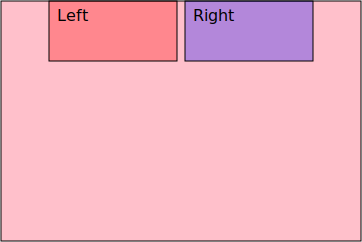|

## MasterDetailLayout

A common layout pattern with a list of items in a left sidebar and a detail view in the main content area. In
mobile, this translates to a navigation of 2 levels: a first screen with the list and a second screen with the
content.

```tsx
<MasterDetailLayout isOpen={isOpen} master={listView} detail={detailView} />
```

The `isOpen` prop controls whether the master (when `false`) or detail (when `true`) view is shown in mobile.

Take into account that the `detail` view is always visible in desktop, so if you want to show an empty state
in desktop when there isn't any selected item from the aside list, you can do something like this:

```tsx
<MasterDetailLayout isOpen={isOpen} master={listView} detail={isOpen ? detailView : emptyCase} />
```

<!-- prettier-ignore -->
|Mobile Master|Mobile Detail|Desktop|
|-|-|-|
|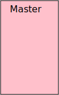|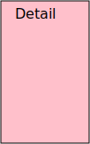|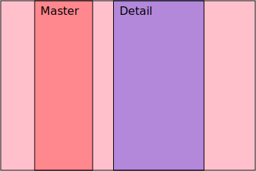|

## FixedFooterLayout

A layout with a footer that sticks to the bottom of the viewport. The footer becomes fixed when there is
enough available height, and scrolls with the content otherwise. Includes an elevation shadow on mobile when
content is scrollable.

```tsx
<FixedFooterLayout
  footer={
    <Box paddingX={16} paddingY={8}>
      <ButtonLayout primaryButton={<ButtonPrimary onPress={handleSubmit}>Confirm</ButtonPrimary>} />
    </Box>
  }
>
  <ResponsiveLayout>
    <Box paddingY={24}>
      <Stack space={16}>{/* page content */}</Stack>
    </Box>
  </ResponsiveLayout>
</FixedFooterLayout>
```

## ButtonFixedFooterLayout

A convenience wrapper around `FixedFooterLayout` specifically for pages that need a fixed footer with buttons.
Handles the button layout, responsive padding, and footer visibility automatically.

```tsx
<ButtonFixedFooterLayout
  button={<ButtonPrimary onPress={handleConfirm}>Confirm</ButtonPrimary>}
  secondaryButton={<ButtonSecondary onPress={handleCancel}>Cancel</ButtonSecondary>}
>
  <ResponsiveLayout>
    <Box paddingY={24}>
      <Stack space={16}>{/* page content */}</Stack>
    </Box>
  </ResponsiveLayout>
</ButtonFixedFooterLayout>
```

## ButtonLayout

Arranges a primary button, secondary button, and/or link in a standardized layout. Handles responsive stacking
and alignment.

```tsx
<ButtonLayout
  align="full-width"
  primaryButton={<ButtonPrimary onPress={handlePrimary}>Accept</ButtonPrimary>}
  secondaryButton={<ButtonSecondary onPress={handleSecondary}>Cancel</ButtonSecondary>}
/>
```

## DoubleField

Places two form fields side by side with configurable width ratios (`'50/50'`, `'40/60'`, `'60/40'`). Used
inside forms to group related fields horizontally.

```tsx
<DoubleField layout="50/50">
  <TextField name="firstName" label="First name" />
  <TextField name="lastName" label="Last name" />
</DoubleField>
```

---

## Vertical rhythm

Vertical rhythm is an important concept in web design and development. It makes the page feel consistent and
visually pleasant. It is important to maintain the rhythm across the site.

Elements inside our page content can be divided in 3 main groups:

- **Container**: should have a top and bottom space of 24px
- **Sections**: should have a 32px space between them
- **Elements**: should have a 16px separation between them

This is how a page layout could look like:

```tsx
<HeaderLayout header={<Header title="Header" />} />
<ResponsiveLayout>
  <Box paddingY={24}>
    <Stack space={32}>
      <Stack space={16}>
        <Title1>Section 1</Title1>
        <Text2 regular>
          Some example text
        </Text2>
      </Stack>

      <Stack space={16}>
        <Title1>Section 2</Title1>
        <NegativeBox>
          <RowList>
            <Row1 />
            <Row2 />
            <Row3 />
          </RowList>
        </NegativeBox>
      </Stack>
    </Stack>
  </Box>
</ResponsiveLayout>
```

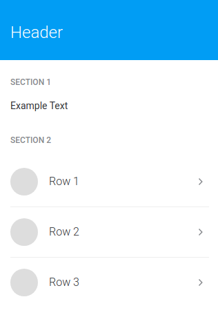

:pencil2:
[View this example in playroom](https://mistica-web.vercel.app/playroom#?code=N4Igxg9gJgpiBcIA8AJGBDWAnAMugnhAK4AuABABYbYC8wq1MWZJAliQDYw0A6IamJnzIB6AHwBfUWJ4A7JACUYAZwAOEWctYA3GHkKkZssmSQAhCAA8yqzFFayA5gE06AJgAsEoyZNIAyiToYADWZGrB3MAAzG7ecr6%2BAUGh4bZgUQCMAGzxxolJ-jBgbBoAKuxcYkUlrBpkmUgiNaWyFZwwPgV%2BZTCWJG5kWDCORBzoWGIAopboALaqXGS9-U0rA12JTYHBIZuFKWERGXQ5ed1%2BLXVtlZ1X9W7bxa3tVQkXSAByI%2BhsuhaWfbdRQQADuOFYyhIQI%2BCjB7wuBVYkFkdCQAGFWFgwEsAEa7RxYYiyKDoiAcCBYOiQClYZQAOlkMFIWHQHBwYKkWgAXlEPAAGKTiCQIxG%2BNgdXggOGghp8UVisgaAAKw2UyjoAAoAJRkGhiMjACQi-KK8QK2Hw02KsjIjRozHYvEEolEElk2nU8mUhlMllsjmgrmsXl0AVCyQWxESrhSmVkNzy62KlVqjXAHV6g1Gk026RRgog0EF7p21H0R04mBkfGhQnE0neqnAGk%2BxnMkis9mc8IhvmC6S5vMsW5xsFkaJJ4dK2SqlTpzP6w3Gku%2Bc3JwsiGUQqEwvwib6OX46GAAmHbQ77C%2B7LpNM9yJpKNQaLS6fTEaFyEAAGhAJCocwqAgADaIAALIQNokJBFgIAALq-qCrBQP%2ByggbE-JwRIQA)

## Doubts?

Don't hesitate to ask at
[Mistica Teams](https://teams.microsoft.com/l/channel/19%3ad2e3607a32ec411b8bf492f43cd0fe0c%40thread.tacv2/General?groupId=e265fe99-929f-45d1-8154-699649674a40&tenantId=9744600e-3e04-492e-baa1-25ec245c6f10)
