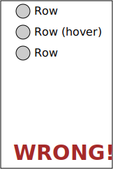
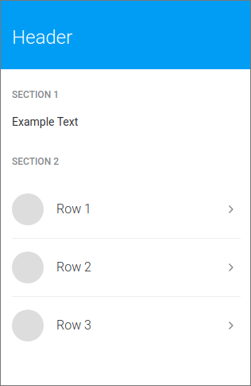

# Layout

<!-- TOC depthFrom:2 -->

- [Box](#box)
- [Stack](#stack)
- [Inline](#inline)
  - [numeric space](#numeric-space)
  - [between](#between)
  - [around](#around)
  - [evenly](#evenly)
- [ResponsiveLayout](#responsivelayout)
- [HeaderLayout](#headerlayout)
- [GridLayout](#gridlayout)
- [Basic](#basic)
  - [Grid template 6+6](#grid-template-66)
  - [Grid template 8+4](#grid-template-84)
- [NegativeBox](#negativebox)
  - [Without NegativeBox](#without-negativebox)
  - [With NegativeBox](#with-negativebox)
- [Vertical ryhthm](#vertical-ryhthm)
- [Doubts?](#doubts)

<!-- /TOC -->

## Box

Box provides a set of padding options which can be used to create container elements with **internal**
spacing.

Accepted props:

- `padding`
- `paddingX` / `paddingY`
- `paddingTop` / `paddingRight` / `paddingBottom` / `paddingLeft`

```tsx
<Box paddingX={16} paddingY={32}>
  <Child />
</Box>
```


:warning: Do not use `Box` to add external spacings or distribute items, instead use `Stack` or `Inline`.

## Stack

Vertically distributes its children using the given `space` separation

```tsx
<Stack space={24}>
  <Child1 />
  <Child2 />
  <Child3 />
</Stack>
```


## Inline

Horizontally distributes its children using the given `space` separation. This component can be considered as
an horizontal `Stack`

:information_source: Items can be aligned vertically. Check `Inline` component in
[Storybook](https://mistica-web.vercel.app/?path=/story/components-layouts-inline) to learn more about it.

### numeric space

```tsx
<Inline space={16}>
  <Child1 />
  <Child2 />
  <Child3 />
</Inline>
```


### between

Distribute items evenly. The first item is flush with the start, the last is flush with the end

```tsx
<Inline space="between">
  <Child1 />
  <Child2 />
  <Child3 />
</Inline>
```


### around

Distribute items evenly. Items have a half-size space on either end

```tsx
<Inline space="around">
  <Child1 />
  <Child2 />
  <Child3 />
</Inline>
```


### evenly

Distribute items evenly. Items have equal space around them

```tsx
<Inline space="evenly">
  <Child1 />
  <Child2 />
  <Child3 />
</Inline>
```


## ResponsiveLayout

This component creates a responsive container for your page content. The size of this container depends on the
viewport size.

```tsx
<ResponsiveLayout>
  <MyFeature />
</ResponsiveLayout>
```

<!-- prettier-ignore -->
|Mobile|Tablet|Desktop|
|-|-|-|
||||

## HeaderLayout

The `HeaderLayout` is responsible for render the page header and related components. It uses the
`ResponsiveLayout` internally so you must not wrap it inside one.

```tsx
<HeaderLayout header={<Header title="Header" />} />
<ResponsiveLayout>
  <MyFeature />
</ResponsiveLayout>
```

<!-- prettier-ignore -->
|Mobile|Tablet|Desktop|
|-|-|-|
||||

## GridLayout

The `GridLayout` uses defines a grid with a set of columns where you can place your components. Different
screen sizes will have different number of columns. This component must be used inside a `ResponsiveLayout`

## Basic

```tsx
<ResponsiveLayout>
  <GridLayout>
    <Component1 />
    <Component2 />
    {/* ... */}
    <ComponentN />
  </GridLayout>
</ResponsiveLayout>
```

<!-- prettier-ignore -->
|Mobile|Tablet|Desktop|
|-|-|-|
|1 column|1 column|12 columns|
||||

This layout is quite low level and not very useful by its own. When implementing a feature, use one of the
available grid templates

### Grid template 6+6

<!-- prettier-ignore -->
```tsx
<ResponsiveLayout>
  <GridLayout
    template="6+6"
    left={<LeftComponent />}
    right={<RightComponent />}
  />
</ResponsiveLayout>
```

<!-- prettier-ignore -->
|Mobile|Tablet|Desktop|
|-|-|-|
||||

### Grid template 8+4

<!-- prettier-ignore -->
```tsx
<ResponsiveLayout>
  <GridLayout
    template="8+4"
    left={<LeftComponent />}
    right={<RightComponent />}
  />
</ResponsiveLayout>
```

<!-- prettier-ignore -->
|Mobile|Tablet|Desktop|
|-|-|-|
||||

## NegativeBox

Some components, like non boxed Lists, need to be rendered overflowing its container, because the hover effect
is larger than the container. This can be achieved using a `NegativeBox`

### Without NegativeBox

<!-- prettier-ignore -->
|Outline|Preview|
|-|-|
|||

As you can see there are two problems. The hover is not filling available horizontal space and Row circles are
not aligned with the content container. These problems are solved using `NegativeBox`.

### With NegativeBox

```tsx
<ResponsiveLayout>
  <NegativeBox>
    <RowList>
      <Row1 />
      <Row2 />
      <Row3 />
    </RowList>
  </NegativeBox>
</ResponsiveLayout>
```

<!-- prettier-ignore -->
|Outline|Preview|
|-|-|
|||

Hover effect fills horizontal space and circles are aligned with the container edge.

## Vertical ryhthm

Vertical rhythm is an important concept in web design and development. It makes the page feel consistent and
visually pleasant. It is important to maintain the rhythm across the site.

Elements inside our page content can be divided in 3 main groups:

- **Container**: should have a top and bottom space of 24px
- **Sections**: should have a 32px space between them
- **Elements**: should have a 16px separation between them

This is how a page layout could look like:

```tsx
<HeaderLayout header={<Header title="Header" />} />
<ResponsiveLayout>
  <Box spaceY={24}>
    <Stack space={32}>
      <Stack space={16}>
        <SectionTitle>Section 1</SectionTitle>
        <Text2 regular>
          Some example text
        </Text2>
      </Stack>

      <Stack space={16}>
        <SectionTitle>Section 2</SectionTitle>
        <NegativeBox>
          <RowList>
            <Row1 />
            <Row2 />
            <Row3 />
          </RowList>
        </NegativeBox>
      </Stack>
    </Stack>
  </Box>
</ResponsiveLayout>
```



:pencil2:
[View this example in playroom](https://mistica-web.vercel.app/playroom#?code=N4Igxg9gJgpiBcIA8AJGBDWAnAMugnhAK4AuABABYbYC8wq1MWZJAliQDYw0A6IamJnzIB6AHwBfUWJ4A7JACUYAZwAOEWctYA3GHkKkZssmSQAhCAA8yqzFFayA5gE06AJgAsEoyZNIAyiToYADWZGrB3MAAzG7ecr6%2BAUGh4bZgUQCMAGzxxolJ-jBgbBoAKuxcYkUlrBpkmUgiNaWyFZwwPgV%2BZTCWJG5kWDCORBzoWGIAopboALaqXGS9-U0rA12JTYHBIZuFKWERGXQ5ed1%2BLXVtlZ1X9W7bxa3tVQkXSAByI%2BhsuhaWfbdRQQADuOFYyhIQI%2BCjB7wuBVYkFkdCQAGFWFgwEsAEa7RxYYiyKDoiAcCBYOiQClYZQAOlkMFIWHQHBwYKkWgAXlEPAAGKTiCQIxG%2BNgdXggOGghp8UVisgaAAKw2UyjoAAoAJRkGhiMjACQi-KK8QK2Hw02KsjIjRozHYvEEolEElk2nU8mUhlMllsjmgrmsXl0AVCyQWxESrhSmVkNzy62KlVqjXAHV6g1Gk026RRgog0EF7p21H0R04mBkfGhQnE0neqnAGk%2BxnMkis9mc8IhvmC6S5vMsW5xsFkaJJ4dK2SqlTpzP6w3Gku%2Bc3JwsiGUQqEwvwib6OX46GAAmHbQ77C%2B7LpNM9yJpKNQaLS6fTEaFyEAAGhAJCocwqAgADaIAALIQNokJBFgIAALq-qCrBQP%2ByggbE-JwRIQA)

## Doubts?

Don't hesitate to ask at
[Mistica Teams](https://teams.microsoft.com/l/channel/19%3ad2e3607a32ec411b8bf492f43cd0fe0c%40thread.tacv2/General?groupId=e265fe99-929f-45d1-8154-699649674a40&tenantId=9744600e-3e04-492e-baa1-25ec245c6f10)
