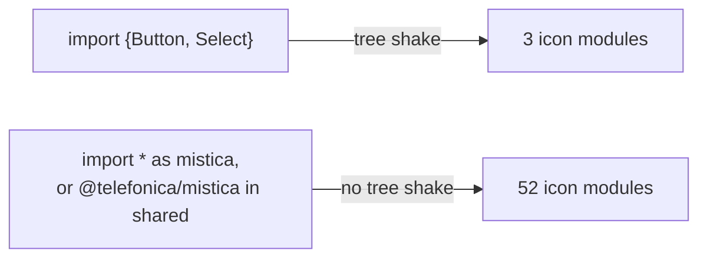

# Module Federation example

Two webpack applications on one page: a **host** on port 3001 and a **remote** on port 3002. Both share
`@telefonica/mistica` as a shared singleton. The remote exposes a card, and the host loads it.

This example exists for issue [#1643](https://github.com/Telefonica/mistica-web/issues/1643). It measures what
a federated page downloads, and it proves that one theme serves both applications.

Module Federation is a webpack feature, so this example uses webpack. The library itself builds with Vite.

## Run it

```bash
# in the root of the repository
yarn build

# here
yarn install
yarn measure   # builds the two applications, reports the files that each one emits
yarn verify    # loads the page in a browser, reports the downloads, fails on an error
```

`yarn verify` fails when the remote does not render, when no icon appears, or when the page logs an error. It
also writes `host/dist/page.png`.

⚠️ `yarn test-ssr` in the root rebuilds the library with `NODE_ENV=test`, which produces a development build
that uses `react/jsx-dev-runtime`. Run `yarn build` again before you measure, or the page fails with "jsxDEV
is not a function".

To open the page by hand, start the two development servers in two terminals:

```bash
yarn dev:remote
yarn dev:host
```

Then open http://localhost:3001. The remote alone answers on http://localhost:3002.

⚠️ The server of the remote must allow a cross-origin read of `remoteEntry.js`. webpack-dev-server 5.2.6
answers `Cross-Origin-Resource-Policy: same-origin` by default, and the browser then reports _"blocked due to
its Cross-Origin-Resource-Policy header"_. `webpack.shared.js` exports the two headers that remove the block.

## Measured result

| Configuration                                                        | Emitted  | The page downloads | Requests |
| -------------------------------------------------------------------- | -------- | ------------------ | -------- |
| `@telefonica/mistica@17.4.0`, one application, icons from the barrel | 10.06 MB | **9463.8 kB**      | 7        |
| This branch, host **and** remote, icons out of `shared`              | 4.79 MB  | **1711.0 kB**      | 10       |
| This branch, host and remote, icons shared by path prefix            | 5.35 MB  | 1758.9 kB          | 63       |

The first row is the problem of the issue: the shared module keeps every export, so the barrel of 2207 icons
reaches the page. The second row is this branch, and it carries a whole second application for 18% of the
bytes.

The emitted column is larger than the download column, because each application also emits its own copy of
every shared module, as a fallback for the case where it runs alone. The browser downloads one of those
copies.

Both columns count JavaScript only. Each application also emits the four `.woff2` files of the skin, 275 kB
together. A woff2 file carries its own compression, so gzip does not shrink it.

## Do not share the icons

The third row is the warning. `'@telefonica/mistica-icons/': {}` shares each module under the prefix on its
own, so the page makes 63 requests instead of 10, and it downloads slightly more. Each icon becomes one shared
module, one chunk and one fallback copy, including the 52 icons that the components of Mística render
themselves.

So the recommendation is simple: **leave `@telefonica/mistica-icons` out of the `shared` list**. Each
application then bundles the icons that it uses. An icon holds no state, so a second copy is safe.

Set `SHARE_ICONS=1` to measure the other configuration:

```bash
SHARE_ICONS=1 yarn measure && yarn verify
```

The bare name never works:

```js
// the container finds no module to provide, because the package has no entry point
shared: {'@telefonica/mistica-icons': {}}
```

## Where the 52 icons come from

The components of Mística render icons themselves. The build of the library holds 72 icon import statements,
and they resolve to 52 distinct modules, because several components ask for the same icon: 12 modules import
`icon-close-regular`, and 4 import `icon-calendar-regular`. `Select` imports `icon-chevron-down-regular` for
the arrow and `icon-warning-regular` for the error state, `DateField` imports `icon-calendar-regular`, and
`Dialog` imports `icon-close-regular`.

An application pays for the components that it imports. A shared module pays for every component, because
webpack cannot remove an export from a shared module: another remote can ask for that export at runtime.



Four bundles without module federation measure the first branch. Each figure counts every file that the build
emits, react and the asynchronous chunks included.

| The application imports                       | Icon modules | JavaScript |
| --------------------------------------------- | ------------ | ---------- |
| `ThemeContextProvider`, `Button`              | 1            | 164.8 kB   |
| `ThemeContextProvider`, `Select`              | 3            | 245.9 kB   |
| the two above, plus `Callout` and `DateField` | 4            | 603.3 kB   |
| `import * as mistica`, the whole barrel       | 52           | 2165.2 kB  |

The 52 icons cost 218.3 kB of that last figure, which is 4.2 kB for one icon: the same barrel with a stub in
place of each icon builds to 1946.9 kB. The first row of the measured result above shows what the split
removed. There the shared barrel of 17.4.0 carried 2207 icons, and the page downloaded 9463.8 kB.

The first row of this table needs one icon, and that icon is `icon-close-regular`. `ThemeContextProvider`
mounts the dialog root and the snackbar root, `dialog-context.js` loads `dialog.js` with a dynamic import, and
`snackbar-context.js` loads `snackbar.js`. The icon therefore waits in those two chunks, and a page that opens
neither never downloads it.

## Four details that a host needs

The example failed four times before it rendered. Each failure is a common one, and the code carries a comment
for each.

| Detail                                                               | Symptom when it is missing                                                                                                                                                                                                                                                |
| -------------------------------------------------------------------- | ------------------------------------------------------------------------------------------------------------------------------------------------------------------------------------------------------------------------------------------------------------------------- |
| **An async boundary.** The entry only calls `import('./bootstrap')`. | _"Shared module is not available for eager consumption"_. The share scope fills asynchronously, so an entry cannot import a shared module.                                                                                                                                |
| **`output.uniqueName` for each application.**                        | A silent blank page. Both applications write to the same `webpackChunk` global, their chunk registries collide, and a chunk promise never settles.                                                                                                                        |
| **One specifier for the theme.**                                     | _"To use @telefonica/mistica components you must instantiate `<ThemeContextProvider>`"_. Every icon of `@telefonica/mistica-icons` imports `@telefonica/mistica` by its bare name, because the share scope intercepts that name only.                                     |
| **Cross-origin headers on the server of the remote.**                | _"blocked due to its Cross-Origin-Resource-Policy header"_. The host reads `remoteEntry.js` from another origin, and webpack-dev-server 5.2.6 answers `Cross-Origin-Resource-Policy: same-origin` by default. A production server of a remote needs the same two headers. |

## The font comes from the application

Mistica injects no font family, so a page without setup falls back to Times New Roman. Each application
imports the `@font-face` file of its skin, and `global-styles.jsx` sets `font-family` and `background-color`
on `body` from inside `ThemeContextProvider`.

The host owns the page, so the rules of the host reach the components of the remote through `body`. The remote
renders `GlobalStyles` only on its stand-alone page. An import in the shared card would make the page download
the same four files a second time, from the origin of the remote.

`webpack.shared.js` aliases `@fonts` to the `assets/fonts` folder of this repository, and it adds an
`asset/resource` rule for `.woff2`. A real application serves its own copy of those files.
[doc/fonts.md](../../doc/fonts.md) lists the font of each skin.

## Two warnings that the page prints

```
Unsatisfied version 19.2.1 from remote of shared singleton module react (required ^16.8.0 || ^17.0.0 || ^18.0.0)
Unsatisfied version 19.2.1 from remote of shared singleton module react (required ^15.3.0 || ^16.0.0 || ^17.0.0)
```

`react-autosuggest` and `react-datetime`, two dependencies of `@telefonica/mistica`, declare peer ranges that
predate react 19. The page renders, so `yarn verify` reports the warnings and does not fail.

## Reproduce the baseline of 17.4.0

```bash
mkdir /tmp/mf-before && cd /tmp/mf-before
npm install @telefonica/mistica@17.4.0
# copy host/src and host/webpack.config.js, then:
#   - import the icons from '@telefonica/mistica' instead of '@telefonica/mistica-icons/icon-*'
#   - point resolve.alias at /tmp/mf-before/node_modules/@telefonica/mistica
#   - keep the async boundary of host/src/index.jsx
# and build with the webpack of this example
```

## Two details of this example that an application does not need

The `package.json` links the two packages with the `portal:` protocol, so the example measures the build of
this repository instead of a published version. That brings two consequences, and the comments in
`webpack.shared.js` name both:

- `resolve.alias` pins react and react-dom to the copies of this example. The portal keeps the library inside
  the repository, so it would otherwise resolve the react of the repository, and two copies of react break
  every hook.
- `resolve.tsconfig: false` stops webpack 5.111 from applying the `paths` of the `tsconfig.json` of this
  repository, which point at the TypeScript sources for Storybook and for the tests.

An application that installs `@telefonica/mistica` and `@telefonica/mistica-icons` from npm needs neither
line.
